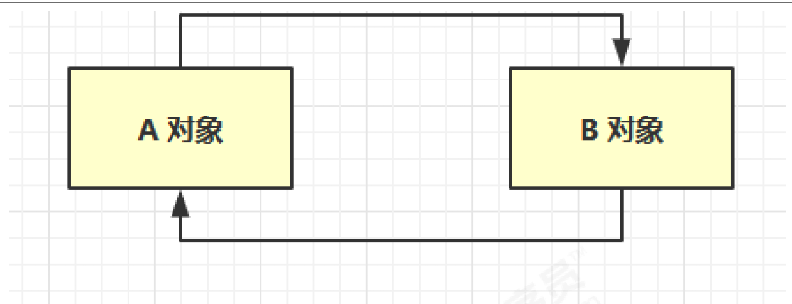

# 垃圾收回

## 1.如何判断对象可以回收

### 1.1 引用计数法

代表作:早期的python vm听说是用这种算法的

### 1.2 可达性分析算法

Java 虚拟机中的垃圾回收器采用可达性分析来探索所有存活的对象

扫描堆中的对象，看是否能够沿着 GC Root对象 为起点的引用链找到该对象，找不到，表示可以

回收

哪些对象可以作为 GC Root ?

### 1.3 四种引用

#### 1.强引用

只有所有 GC Roots 对象都不通过【强引用】引用该对象，该对象才能被垃圾回收

#### 2.软引用（SoftReference）

仅有软引用引用该对象时，在垃圾回收后，内存仍不足时会再次出发垃圾回收，回收软引用

对象

可以配合引用队列来释放软引用自身

#### 3.弱引用（WeakReference）

仅有弱引用引用该对象时，在垃圾回收时，无论内存是否充足，都会回收弱引用对象

可以配合引用队列来释放弱引用自身

#### 4.虚引用（PhantomReference）

必须配合引用队列使用，主要配合 ByteBuffer 使用，被引用对象回收时，会将虚引用入队，

由 Reference Handler 线程调用虚引用相关方法释放直接内存

#### 5.终结器引用（FinalReference）

无需手动编码，但其内部配合引用队列使用，在垃圾回收时，终结器引用入队（被引用对象

暂时没有被回收），再由 Finalizer 线程通过终结器引用找到被引用对象并调用它的 finalize

方法，第二次 GC 时才能回收被引用对象

北京市昌平区建材城西路金燕龙办公楼一层 电话：400-618-9090

## 2.垃圾回收算法

2.1 标记清除

定义： Mark Sweep

速度

## 2.垃圾回收算法

## 3.分代垃圾回收

## 4.垃圾回收器

## 5.垃圾回收调优