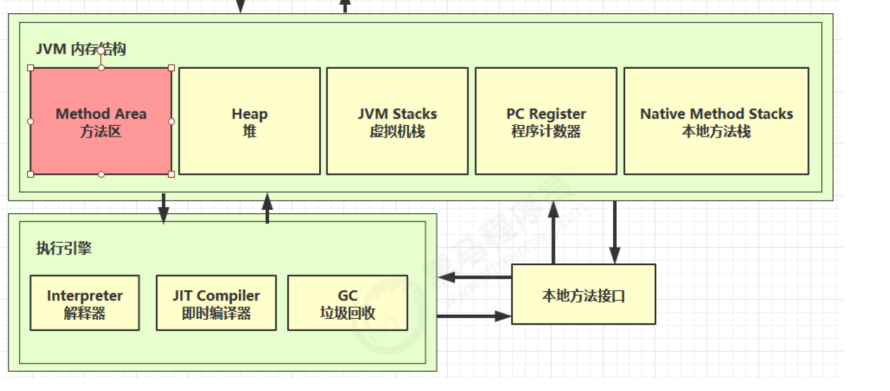
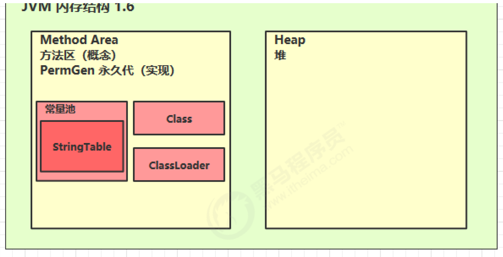
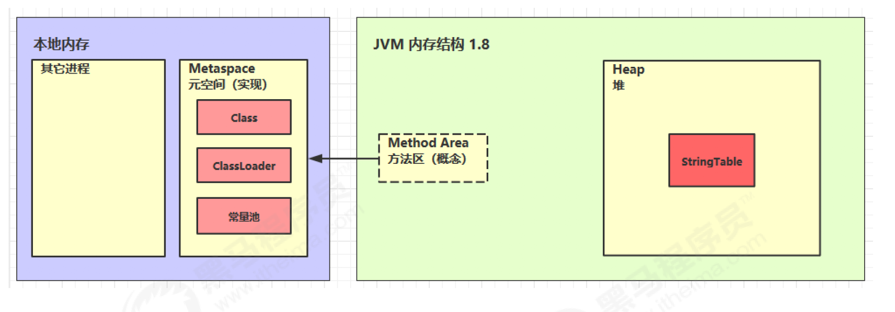
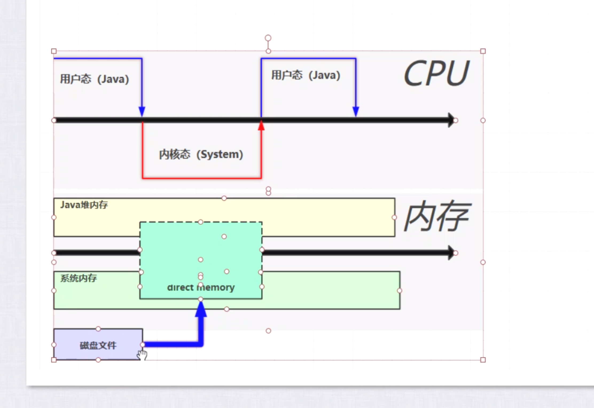

# 内存结构

## 1.程序计数器


### 1.1 定义

Program Counter Register 程序计数器（寄存器）

#### 作用:

- 是记住下一条jvm指令的执行地址

#### 特点

- 是线程私有的
- 不会存在内存溢出

### 1.2 作用

```reStructuredText
0: getstatic #20 // PrintStream out = System.out;
3: astore_1 // --
4: aload_1 // out.println(1);
5: iconst_1 // --
6: invokevirtual #26 // --
9: aload_1 // out.println(2);
10: iconst_2 // --
11: invokevirtual #26 // --
14: aload_1 // out.println(3);
15: iconst_3 // --
16: invokevirtual #26 // --
19: aload_1 // out.println(4);
20: iconst_4 // --
21: invokevirtual #26 // --
24: aload_1 // out.println(5);
25: iconst_5 // --
26: invokevirtual #26 // --
29: return
```


## 2.虚拟机栈


### 2.1 定义

Java Virtual Machine Stacks （Java 虚拟机栈）

- 每个线程运行时所需要的内存，称为虚拟机栈
- 每个栈由多个栈帧（Frame）组成，对应着每次方法调用时所占用的内存
- 每个线程只能有一个活动栈帧，对应着当前正在执行的那个方法


**问题辨析**

1. 垃圾回收是否涉及栈内存？

   > 答:垃圾回收只管理堆内存. 栈内存当即会释放,自动会回收,不需要垃圾回收管理

2. 栈内存分配越大越好吗？

   > 答:-Xss来设置栈内存大小, 默认1024kb,栈内存越大反而会让线程数就会越少
   >
   > 比如:因为线程用的也是栈内存,假设一个线程用1M,物理内存假设有500M,理论上可以有500个线程,如果我设置线程栈内存设置2M,那么我理论线程数最多只有250个.

3. 方法内的局部变量是否线程安全？

> 答:
>
> - 如果方法内局部变量没有逃离方法的作用访问，它是线程安全的
> - 如果是局部变量引用了对象，并逃离方法的作用范围，需要考虑线程安全
>


### 2.2 栈内存溢出

- 栈帧过多导致栈内存溢出

  > 答:
  >
  > 如: (1).递归调用,没有正确的结束递归,就会导致栈内存不够溢出
  >
  > ​	  (2).第三方把对象转成json的例子:循环引用,比如,a引用b,b引用a,进行json转化时	

- 栈帧过大导致栈内存溢出

  

### 2.3 线程运行诊断

##### 案例1： cpu占用高,jstack找代码行号

**定位**

- **用top定位哪个进程对cpu的占用过高**

ps H -eo pid,tid,%cpu | grep **进程id** （用ps命令进一步定位是哪个线程引起的cpu占用过高）

- **jstack 进程id**

可以根据线程id 找到有问题的线程，进一步定位到问题代码的源码行号

##### 案例2：程序长时间没有结果,jstack找代码死锁行号

通过输入进程id,在最后,一般可以看到Found one java-level deadlock

并找到行号


## 3.本地方法栈


## 4.堆

可以虚拟机使用 

```
-Xmx
```

 参数来控制堆内存大小


### 4.1 定义

**Heap 堆**

通过 new 关键字，创建对象都会使用堆内存

**特点**

- 它是**线程共享**的，**堆中对象**都需要**考虑线程安全**的问题
- 有**垃圾回收机制**


### 4.2 堆内存溢出

可以虚拟机使用 

```
-Xmx
```

 参数来控制堆内存大小.可以放大,放小堆内存

### 4.3 堆内存诊断

1. **jps 工具**

查看当前系统中有哪些 java 进程

2. **jmap 工具**

查看堆内存占用情况 jmap - heap 进程id

3. **jconsole 工具**

图形界面的，多功能的监测工具，可以连续监测

死锁什么的,也可以检测

#### 案例

##### 垃圾回收后，内存占用仍然很高

使用jvisualVM,通过用heap Dump后,通过查看前20个,

即可找到用到最大的内存的对象


## 5.方法区



### 5.1定义:

1. 逻辑上是属于**堆的组成部分**
2. 它是**jvm所有线程共享**的
3. 它用于**保存类结构**, 如常量池,,字段,构造函数,成员方法,方法数据,其实就是**类相关的信息**

它是在jvm启动时被创建方法区堆内存

> 在jdk1.6中,是在PermGen(永久代)的堆内存空间实现的
>
> 但在jdk1.8中,已经在metaspace(元空间->就是本地内存)里实现了


### 5.2 组成

> **在jdk1.6中,是在PermGen(永久代)的堆内存空间实现的**



> **但在jdk1.8中,已经在metaspace(元空间->就是本地内存)里实现了**



### 5.3 方法区内存溢出

**jdk 1.8 以前会导致永久代内存溢出**

```
jvm参数: -XX:MaxPermSize=8m
```


**jdk 1.8 之后会导致元空间内存溢出**

```
 -XX:MaxMetaspaceSize=8m
```


#### 场景

- 使用ClassWriter生成二进制字节码,并加载.

\* 演示永久代内存溢出 java.lang.OutOfMemoryError: PermGen space

\* -XX:MaxPermSize=8m

\* 演示元空间内存溢出 java.lang.OutOfMemoryError: Metaspace

\* -XX:MaxMetaspaceSize=8m


### 5.4 运行时常量池

- 常量池，就是一张表，虚拟机指令根据这张常量表找到要执行的类名、方法名、参数类型、字面量

  等信息

- 运行时常量池，常量池是 *.class 文件中的，当该类被加载，它的常量池信息就会放入运行时常量

  池，并把里面的符号地址变为真实地址


### 5.5 StringTable

- 常量池中的字符串仅是符号，第一次用到时才变为对象

- 利用串池的机制，来避免重复创建字符串对象

- 字符串变量拼接的原理是 StringBuilder （1.8）

- 字符串常量拼接的原理是编译期优化

- 可以使用 intern 方法，主动将串池中还没有的字符串对象放入串池

  -  1.8 将这个字符串对象尝试放入串池，如果有则并不会放入，如果没有则放入串池， 会把串

   池中的对象返回

  -  1.6 将这个字符串对象尝试放入串池，如果有则并不会放入，如果没有会把此对象复制一份，

   放入串池， 会把串池中的对象返回


### 5.6 StringTable 位置


- 在1.6时,它在永久代当中


**在jdk1.7, 1.8中已经移到了堆中,因为在1.6时,在永久代中,回收效率很低.所以把它移到了到堆中.


```
-XX:MaxPermSize=8m  这里设置永久代8m

-Xmx10m 设置堆内存,设置堆内存10m

在演示这个回收前,可以关掉-XX:-UseGCOverheadLimit来禁止GC抛异常

```


### 5.7 StringTable 垃圾回收

```
-Xmx10m 设置堆内存10m
-XX:+PrintStringTableStatistic 打印StringTable统计信息
-XX:+PrintGCDetails -verbose    打印垃圾回收的详细信息,和,花费时间

```


### 5.8 StringTable 性能调优

StringTable其实也是一样hash表,一般默认桶个数是60013个,最小只能是大于1009的数

调化思路:在jvm上 调整

```
-XX:StringTableSize=桶个数
```

这样就可以把桶个数放大,性就会更好一点. 因为桶的数量多,就不减少了hash表的查找次数,所以性能会好很多 

Twitter案例,用String.intern()方法,节省了大量内存


## 6.直接内存

### 6.1 定义

Direct Memory

常见于 **NIO 操作时**，用于数据缓冲区

**分配回收成本较高**，但**读写性能高**

**不受 JVM 内存回收管理**




### 6.2 分配和回收原理

使用了 **Unsafe 对象完成直接内存的分配回收**，并且回收需要主动调用 **freeMemory 方法**

ByteBuffer 的实现类内部，**使用了 Cleaner （虚引用）来监测 ByteBuffer 对象**，一旦

ByteBuffer 对象被垃圾回收，那么就会由 **ReferenceHandler 线程通过 Cleaner 的 clean 方法调**

**用 freeMemory 来释**放直接内存


注意:

```
尽量不要使用System.GC(),因为是会触发Full GC和其它的GC, 性能不好. 一般禁止使用
```

