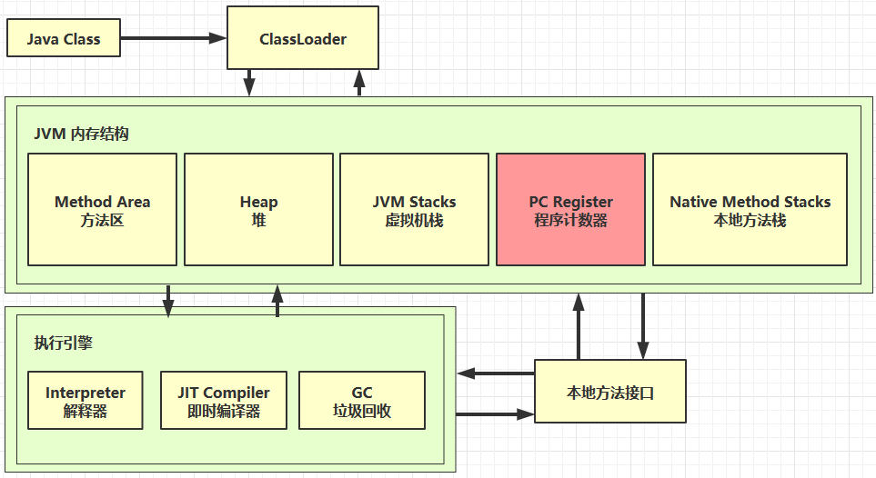

# 内存结构

## 1.程序计数器




### 1.1 定义

Program Counter Register 程序计数器（寄存器）

#### 作用:

是记住下一条jvm指令的执行地址

#### 特点

- 是线程私有的
- 不会存在内存溢出

### 1.2 作用

```
0: getstatic #20 // PrintStream out = System.out;
3: astore_1 // --
4: aload_1 // out.println(1);
5: iconst_1 // --
6: invokevirtual #26 // --
9: aload_1 // out.println(2);
10: iconst_2 // --
11: invokevirtual #26 // --
14: aload_1 // out.println(3);
15: iconst_3 // --
16: invokevirtual #26 // --
19: aload_1 // out.println(4);
20: iconst_4 // --
21: invokevirtual #26 // --
24: aload_1 // out.println(5);
25: iconst_5 // --
26: invokevirtual #26 // --
29: return
```


## 2.虚拟机栈

## 3.本地方法栈

## 4.堆

## 5.方法区


