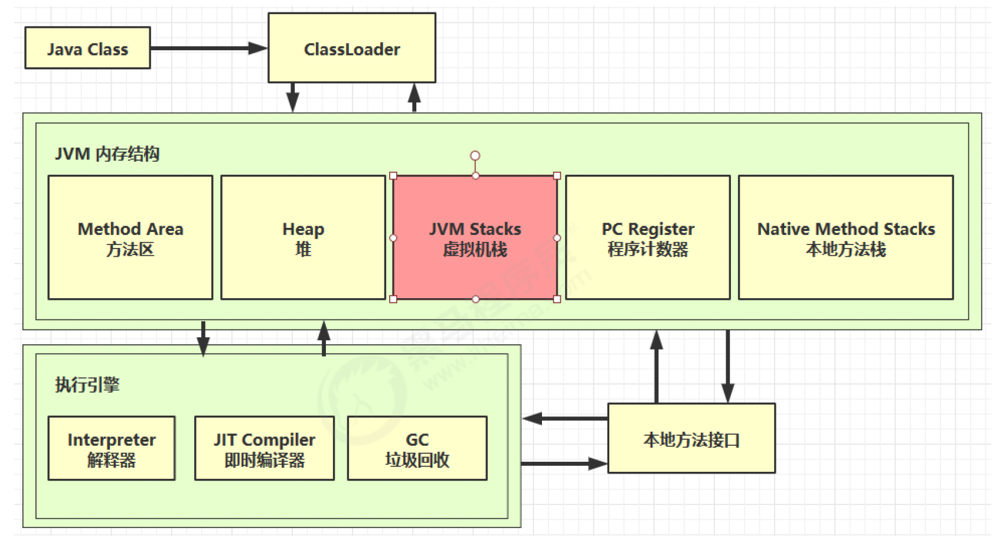
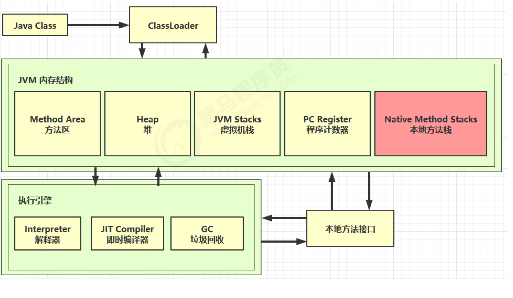
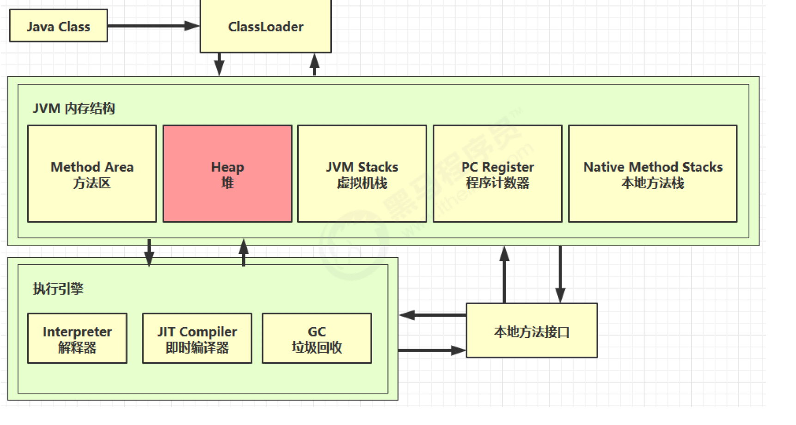

# 内存结构

## 1.程序计数器


### 1.1 定义

Program Counter Register 程序计数器（寄存器）

#### 作用:

- 是记住下一条jvm指令的执行地址

#### 特点

- 是线程私有的
- 不会存在内存溢出

### 1.2 作用

```reStructuredText
0: getstatic #20 // PrintStream out = System.out;
3: astore_1 // --
4: aload_1 // out.println(1);
5: iconst_1 // --
6: invokevirtual #26 // --
9: aload_1 // out.println(2);
10: iconst_2 // --
11: invokevirtual #26 // --
14: aload_1 // out.println(3);
15: iconst_3 // --
16: invokevirtual #26 // --
19: aload_1 // out.println(4);
20: iconst_4 // --
21: invokevirtual #26 // --
24: aload_1 // out.println(5);
25: iconst_5 // --
26: invokevirtual #26 // --
29: return
```


## 2.虚拟机栈



### 2.1 定义

Java Virtual Machine Stacks （Java 虚拟机栈）

- 每个线程运行时所需要的内存，称为虚拟机栈
- 每个栈由多个栈帧（Frame）组成，对应着每次方法调用时所占用的内存
- 每个线程只能有一个活动栈帧，对应着当前正在执行的那个方法


**问题辨析**

1. 垃圾回收是否涉及栈内存？

   > 答:垃圾回收只管理堆内存. 栈内存当即会释放,自动会回收,不需要垃圾回收管理

2. 栈内存分配越大越好吗？

   > 答:-Xss来设置栈内存大小, 默认1024kb,栈内存越大反而会让线程数就会越少
   >
   > 比如:因为线程用的也是栈内存,假设一个线程用1M,物理内存假设有500M,理论上可以有500个线程,如果我设置线程栈内存设置2M,那么我理论线程数最多只有250个.

3. 方法内的局部变量是否线程安全？

> 答:
>
> - 如果方法内局部变量没有逃离方法的作用访问，它是线程安全的
> - 如果是局部变量引用了对象，并逃离方法的作用范围，需要考虑线程安全
>


### 2.2 栈内存溢出

- 栈帧过多导致栈内存溢出

  > 答:
  >
  > 如: (1).递归调用,没有正确的结束递归,就会导致栈内存不够溢出
  >
  > ​	  (2).第三方把对象转成json的例子:循环引用,比如,a引用b,b引用a,进行json转化时	

- 栈帧过大导致栈内存溢出

  

### 2.3 线程运行诊断

##### 案例1： cpu占用高,jstack找代码行号

**定位**

- **用top定位哪个进程对cpu的占用过高**

ps H -eo pid,tid,%cpu | grep **进程id** （用ps命令进一步定位是哪个线程引起的cpu占用过高）

- **jstack 进程id**

可以根据线程id 找到有问题的线程，进一步定位到问题代码的源码行号

##### 案例2：程序长时间没有结果,jstack找代码死锁行号

通过输入进程id,在最后,一般可以看到Found one java-level deadlock

并找到行号


## 3.本地方法栈




## 4.堆

可以虚拟机使用 

```
-Xmx
```

 参数来控制堆内存大小



### 4.1 定义

**Heap 堆**

通过 new 关键字，创建对象都会使用堆内存

**特点**

- 它是**线程共享**的，**堆中对象**都需要**考虑线程安全**的问题
- 有**垃圾回收机制**


### 4.2 堆内存溢出

可以虚拟机使用 

```
-Xmx
```

 参数来控制堆内存大小.可以放大,放小堆内存

### 4.3 堆内存诊断

1. **jps 工具**

查看当前系统中有哪些 java 进程

2. **jmap 工具**

查看堆内存占用情况 jmap - heap 进程id

3. **jconsole 工具**

图形界面的，多功能的监测工具，可以连续监测


## 5.方法区


